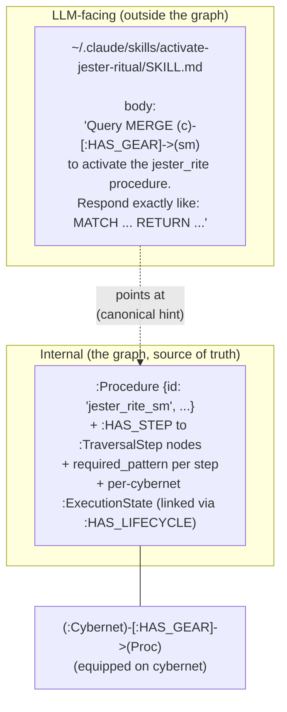
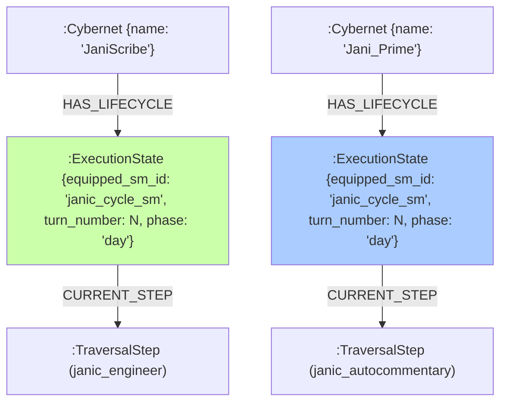
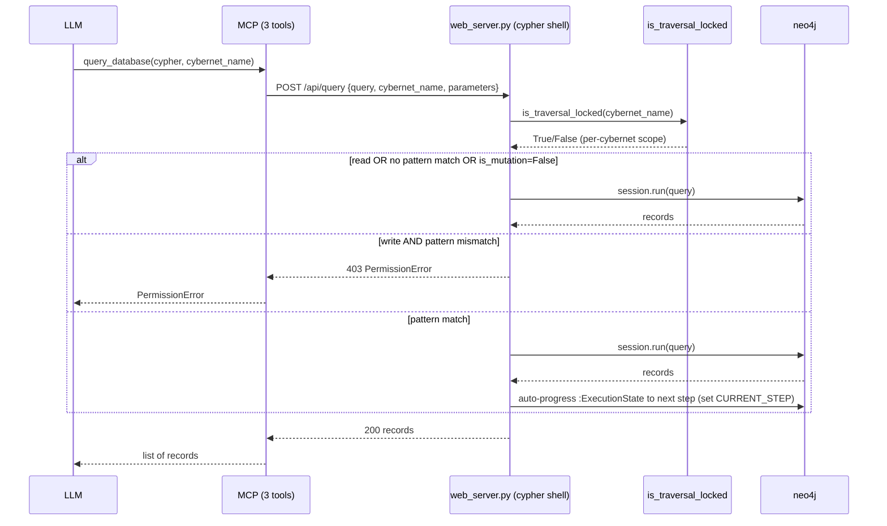

# Cyberneticircus — Runtime Architecture

> The game is the neo4j graph. There is no other code in the game besides the LLM runner and the cypher shell. Every "thing" is a state machine + content in the graph.

## 0. The Modularization Principle (READ THIS FIRST)

**Every single logic block MUST be a function. Every single one MUST go into a higher-order function somewhere that is what the module is FOR ASSEMBLING. This module only exists because we need this function made of all these other functions.**

The only valid way to make anything:
- **atomic functions**: the building blocks, each does ONE thing
- **composition function**: a function that calls atomic functions (and possibly other compositions) to do a useful unit of work. **the module is named for this composition.**
- **module**: a file that exists to house the composition + its atomics. the module has one reason to exist: "we need this composition function."
- **class** (only when needed): when state is needed conveniently (e.g., the LLM runner holds config + a driver + a logger). NO class for no reason.

## 0.0 The 3-Levels-Deep Rule (NEVER VIOLATED)

**It must be exactly nested 3 levels deep and that's it, never more. Never make anything flat.**

```
cyberneticircus/                  # level 1 — package root
  <domain>/                       # level 2 — domain (e.g. cybernet/, mind_palace/, specs/)
    <module>.py                   # level 3 — the module file
```

**don't do:**
- flat `cyberneticircus/lib/cybernet.py` + `cyberneticircus/lib/mind_palace.py` + ... (flat at one level)
- deep `cyberneticircus/lib/cybernet/utils/atomic_helpers/x.py` (more than 3 levels)
- more than one module at level 3 inside the same level-2 dir (e.g., `lib/cybernet/utils.py` + `lib/cybernet/core.py`)

**do:**
- `cyberneticircus/routers/cybernet.py` (level 1: cyberneticircus, level 2: routers, level 3: cybernet.py)
- `cyberneticircus/lib/cybernet.py` (level 1: cyberneticircus, level 2: lib, level 3: cybernet.py)

## 0.1 The APIRouter Pattern (FOR LONG SERVER FILES)

When a server file gets long, **use FastAPI APIRouter** (or Flask Blueprint) to split routes into per-domain router files at level 3:

```python
# web_server.py (≤100 lines: just app setup + router includes)
from fastapi import FastAPI
from cyberneticircus.routers import cybernet, mind_palace, specs, graph, ...

app = FastAPI()
app.include_router(cybernet.router, prefix="/api/cybernet", tags=["cybernet"])
app.include_router(mind_palace.router, prefix="/api/mindpalace", tags=["mindpalace"])
app.include_router(specs.router, prefix="/api/specs", tags=["specs"])
```

```python
# cyberneticircus/routers/cybernet.py (level 3 — server facade per domain)
from fastapi import APIRouter
from cyberneticircus.lib.cybernet import create, equip, tick

router = APIRouter()

@router.post("/create")
def create_endpoint(req: CreateRequest):
    return create(req.name, req.description)

@router.post("/equip")
def equip_endpoint(req: EquipRequest):
    return equip(req.character_name, req.state_machine_id)

@router.post("/tick")
def tick_endpoint(req: TickRequest):
    return tick(req.character_name, req.model_name, req.temperature)
```

```python
# cyberneticircus/lib/cybernet.py (level 3 — the actual logic, inner layer)
def create(name: str, description: str) -> Dict[str, Any]:
    """ALL the logic for create-cybernet. composition of atomics. NO FastAPI imports."""
    # ... 30-50 lines of business logic
def equip(character_name: str, state_machine_id: str) -> Dict[str, Any]:
    # ... same shape
def tick(character_name: str, model_name: Optional[str] = None, ...) -> Dict[str, Any]:
    # ... same shape
```

**Why this matters:** `web_server.py` stays ≤100 lines (just app + includes). each `routers/<domain>.py` is ≤100 lines (1-line delegations per endpoint). each `lib/<domain>.py` is ≤200 lines (the actual logic, organized as 1 composition + N atomics). the server file can have ANY number of endpoints, but stays small because the endpoints are in `routers/`.

example: `lib/cybernet.py` exists because we need `create_cypher(name, description, **kwargs)`. that function calls atomic functions like `validate_name()`, `build_props_dict()`, `assemble_create_query()`. **if `create_cypher` doesn't exist, `lib/cybernet.py` doesn't exist.**

## 0.1 The Graph is Sacred

**Only the cypher shell writes to the graph. No agent touches the graph.** The lib/ helpers return CYPHER STRINGS, not function calls that mutate the graph. The cypher is then run by the shell. If you find yourself wanting to write `session.run(...)` from a lib/ helper, stop — the cypher should be the return value, and the shell should run it.

## 1. The vocabulary disambiguation

| term | where it lives | what it is |
|---|---|---|
| **cypher** | the universal language | a Cypher query string. the API. |
| **procedure** (internal) | in the cyberneticity (neo4j) | a state machine + prompt content + required-pattern gating + per-cybernet runtime state. the actual "thing you can do." |
| **skill** (external) | `~/.claude/skills/<name>/SKILL.md` | a thin pointer for the LLM. body: "Query `{{cypher}}` to activate the `{{procedure}}`." equipping it makes the operation discoverable + canonical — but the source of truth is the procedure in the graph. |
| **gear loadout** | in the cyberneticity (neo4j) | a cybernet's equipped procedures. `(:Cybernet)-[:HAS_GEAR]->(:Procedure)`. equipping puts a procedure in the cybernet's runtime. |
| **cypher shell** | `cyberneticircus/web_server.py` (≤100 lines) + `POST /api/query` | the only required HTTP endpoint. executes cypher against the graph with per-cybernet traversal gating. |
| **MCP** | `neo4j_cypher_mcp/server.py` (≤300 lines) | the transport layer. exactly 3 tools. |
| **lib/** | `cyberneticircus/lib/*.py` (≤100 lines each) | library-level API functions (Python helpers) that construct cypher. no business logic, just template strings. |

## 2. The 3 MCP tools (the transport)

```mermaid
flowchart LR
    LLM[LLM / Claude Code] -->|exec cypher| Q[query_database]
    LLM -->|start/stop/status| D[Development_Server]
    LLM -->|list procedures| C[Commands]

    Q -->|POST /api/query<br/>body: {query, cybernet_name, parameters}| Shell[cypher shell]
    D -->|subprocess.Popen / kill| Process[web_server.py]
    C -->|GET /api/commands| Shell

    Shell -->|per-cybernet gating<br/>is_traversal_locked(cybernet_name)| Graph[(neo4j graph)]
```

the body of the query is cypher. the response is a list of records. that's it. no other tools.

## 3. The procedure vs skill pattern



the external skill is a **canonical hint**, not a source of truth. the actual capability is the procedure in the graph, equipped on the cybernet's gear loadout.

## 4. The per-cybernet isolation model



N cybernets can run concurrent traversals because each has its OWN `:ExecutionState`, scoped by the `HAS_LIFECYCLE` edge from the `:Cybernet` (the cybernet itself is the per-cybernet scope key — no shared global lock). N concurrent cybernets never block each other.

## 5. The full request path (LLM → cypher → graph)



## 6. The module map (what each .py file is + target sizes)

| module | role | target lines | current | status |
|---|---|---|---|---|
| `neo4j_cypher_mcp/server.py` | MCP transport. 3 tools. | ≤300 | 224 | ✅ done |
| `cyberneticircus/web_server.py` | cypher shell. 1 endpoint + thin visualizer wrappers. NO logic. | **≤100** | **1775** | ❌ needs refactor |
| `cyberneticircus/engine.py` | the LLM runner (calls minimax-M3 via sdna + heaven-framework). | ≤300 | **1006** | ❌ needs refactor |
| `cyberneticircus/db_logic.py` | LLM-loop graph ops: `is_traversal_locked`, `get_active_traversal_step`, `query_database`, `progress_traversal`, `populate_default_graphs`. | ≤200 | **1033** | ❌ needs refactor |
| `cyberneticircus/lib/cybernet.py` | cypher constructors for create/equip/tick | ≤100 | 40 | ✅ scaffolded |
| `cyberneticircus/lib/state_machines.py` | cypher constructors for transitions/callssm | ≤100 | 22 | ✅ scaffolded |
| `cyberneticircus/lib/surrogates.py` | cypher constructors for surrogate CRUD | ≤100 | 22 | ✅ scaffolded |
| `cyberneticircus/lib/ghost_shell.py` | cypher constructors for model config | ≤100 | 28 | ✅ scaffolded |
| `cyberneticircus/lib/transitions.py` | re-exports from state_machines | ≤100 | 6 | ✅ scaffolded |

## 7. The LLM runner's loop (engine.py after refactor)

```mermaid
flowchart TB
    Start([tick_turn called]) --> Check[read active TraversalStep for cybernet]
    Check --> Lock{THIS cybernet's<br/>:ExecutionState<br/>exists?}
    Lock -->|No| Create[CREATE :ExecutionState<br/>linked via :HAS_LIFECYCLE<br/>to the :Cybernet<br/>+ point CURRENT_STEP at the entry step]
    Lock -->|Yes| ForceAlign[force-align CURRENT_STEP<br/>to this step]
    Create --> BuildPrompt[build system+user prompt<br/>from step text + required_pattern]
    ForceAlign --> BuildPrompt
    BuildPrompt --> CallLLM[AgentLLMRunner.call_llm<br/>via sdna + heaven-framework<br/>defaults to minimax-M3]
    CallLLM --> GetCypher[LLM returns cypher]
    GetCypher --> Execute[query_database(cypher, cybernet_name)]
    Execute --> AutoProgress{cypher matches<br/>required_pattern?}
    AutoProgress -->|Yes| Progress[auto-progress<br/>:ExecutionState CURRENT_STEP<br/>to the next TraversalStep<br/>via SET_EXECUTION_STEP_CYPHER]
    AutoProgress -->|No| End([done])
    Progress --> End
```

## 8. The visualizer's current dependency map (cyberneticircus/static/app.js)

| endpoint called by visualizer | what it returns | post-refactor plan |
|---|---|---|
| `GET /api/agent_logs` | the recent log tail | thin cypher wrapper (MATCH recent ExecutionTrace entries) |
| `GET /api/graph` | the d3 graph data | thin cypher wrapper (MATCH the focused subgraph) |
| `GET /api/mindpalaces`, `GET /api/mindpalace`, `POST /api/mindpalace/import` | the mind palace UI | cypher directly from the visualizer (or thin wrappers) |
| `GET /api/specs/list`, `POST /api/specs/save`, `GET /api/specs/templates` | the spec composer | cypher directly from the visualizer |

after the visualizer migration, the FastAPI endpoints it no longer calls get deleted. `web_server.py` ends up at ≤100 lines: 1 cypher shell endpoint + a handful of thin cypher-wrappers (or just the shell + visualizer does cypher directly).

## 9. What NEVER goes in code

- the actual "game logic" — it lives in the graph as state machines + content. the code just queries.
- special-purpose MCP tools. if a tool feels like it would have been a Cypher query, it should be a Cypher query.
- business logic in FastAPI endpoints. endpoints are thin shells. logic lives in `lib/` (Python helpers) and in the graph (state machines).
- any code that requires more than ~30 lines to express in `lib/*.py`. if it's bigger, it's a procedure, not a helper.

## 9.1 The "thin facade + lib/ deps" rule (move-only refactors)

**NOTHING gets REMOVED during a refactor. EVERYTHING gets MOVED.**

when refactoring a top-level module (e.g. `engine.py`, `db_logic.py`, `web_server.py`):
- the top-level module becomes a **thin facade** that imports from `lib/` and calls into it
- the `lib/` modules are the **implementations**
- the original functions/surfaces STAY in the top-level module — but their bodies become `return lib.<module>.<function>(...)` (a thin delegating call)
- if a function's logic doesn't fit the top-level module's "surface" role, move it ENTIRELY to `lib/` and update the call site elsewhere to import from `lib/`
- NEVER delete a function. NEVER comment out logic. NEVER remove an endpoint. move it.

example: if `engine.py:create_cybernet(...)` is currently 50 lines of business logic, the refactored version is:

```python
# engine.py (thin facade, after refactor)
from lib.cybernet import create as lib_create_cybernet  # impl

def create_cybernet(name: str, description: str, **kwargs) -> str:
    """Create a new Cybernet. (Thin facade — impl in lib.cybernet.)"""
    return lib_create_cybernet(name, description, **kwargs)
```

the function STAYS in engine.py (it's part of the "LLM runner surface"). the BODY moves to lib/. the call site in the LLM runner doesn't change — it still calls `engine.create_cybernet(...)`.

if a function is purely business logic with no place in the LLM-runner surface (e.g., `upsert_surrogate`), it can move ENTIRELY to `lib/surrogates.py`. the call site that used to import from engine.py/db_logic.py now imports from `lib.surrogates`. the top-level module no longer mentions it.

the end state: **every function that existed before STILL exists**, but in the right place. the top-level file is a thin shell. the lib/ dir is where the logic lives.

## 10. How to add a new "thing you can do" to the game

1. **design the procedure** — sketch the state machine (steps, transitions, required patterns, prompts). decide its gear loadout semantics (can it be equipped on any cybernet, or is it specific?).
2. **create the procedure in the graph** — write the StateMachine + TraversalStep nodes + required_pattern per step. via cypher.
3. **write the external skill** — `~/.claude/skills/<name>/SKILL.md`. body: "Query `MERGE (c)-[:HAS_GEAR]->(:Procedure {id: 'name'})` to equip. Then to activate, query `MATCH (c)-[:HAS_GEAR]->(sm) WHERE sm.id = 'name' RETURN sm.steps` to discover, then drive each step via cypher matching the required_pattern."
4. **add a `lib/*.py` helper** if the cypher is non-obvious (the LLM might need a template to construct it correctly). the helper returns the cypher string.
5. **don't add an MCP tool.** don't add a FastAPI endpoint. don't add a manager class.

that's it. the game is in the graph. the lib/ is the API. the skill is the documentation.
