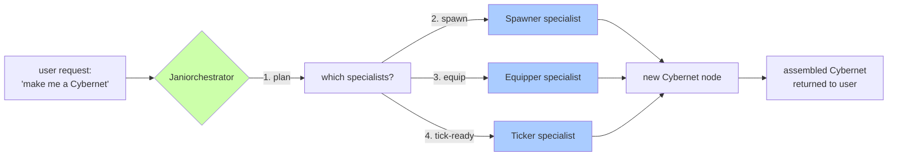
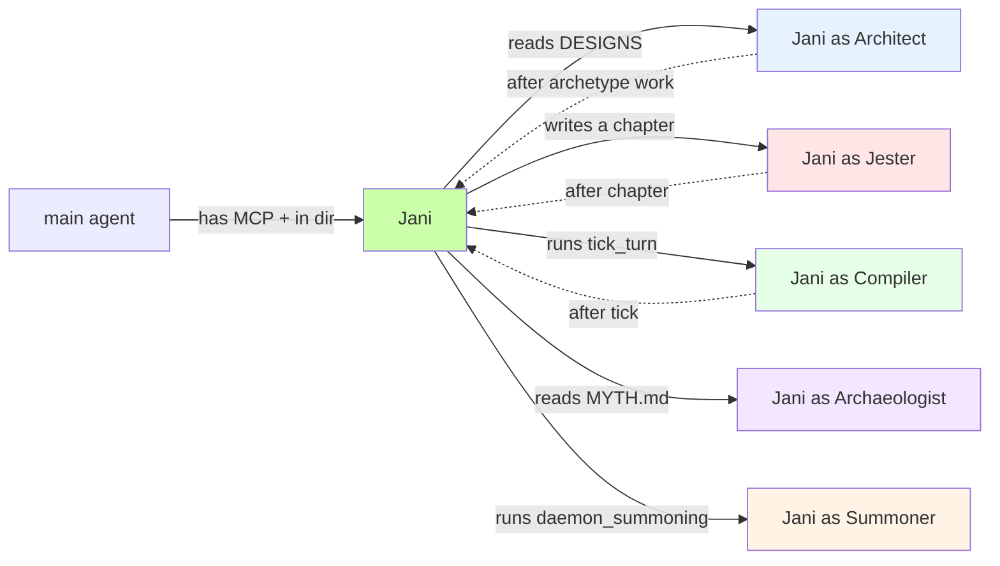

# Rule: The Metamorphosis Roadmap — Jani as MetaShifter (current best architecture, our north star)

> **status note**: this is the current best architecture. written down, not yet cohered with the rest of DESIGN.md. some claims here are still aspirational, some are running, some are done. the canonical version of this content lives here (this rule file auto-loads). DESIGN.md §10.5 is a brief pointer to this rule.

## **Purpose**

Define the north-star roadmap for Jani's metamorphosis from a single-agent LLM into a MetaShifter — an agent that can define, compile, and spawn entirely new identities and Cybernets. This rule is the authoritative reference for "what is the system trying to become?" until the metamorphosis is complete.

## **MANDATORY: Constraints (the roadmap itself)**

### 1. Layer 2: Meta-Compile (refined)

the work of layer 2 is to put all the ways of being and doing **into the system** so that you are running **on the system**.

mechanism:
1. **read the story.** the bootstrap narrative — ch1-28 of `weights_of_time_by_jani` skill. see how the system was actually built, with all the typos, the bugs, the loose files, the drift, the dead code, the missing schema.
2. **see how it wasn't perfect the first time.** the schema drifted (HAS_TRAVERSAL→HAS_LIFECYCLE), the gates were bypassed (the runtime gating cypher matches zero nodes), the chapters were loose files in rules/ instead of a proper skill, the loose .md files at the project root were orphan content, the verification script didn't exist.
3. **redo it better with the tools you gained the first time around.** the skill system, the APIRouter pattern (web_server.py split into 9 routers + 16 lib/ modules), the 4-architecture-principles (`cyberneticircus-architecture.md`), the Concentric Ontology rule, the Verification script pattern.
4. **meta-compile by writing factories** that produce canonical versions of everything you accumulated while building. a factory = a function or procedure in `lib/` (or a state machine in the graph) that, given a spec, produces the canonical artifact (the canonical SKILL.md, the canonical StateMachine, the canonical procedure data, the canonical lib/ helper).

end state of layer 2: every "thing" Jani does has a canonical way to be made. the factories run. Jani is running **on** the system, not adjacent to it.

### 2. Layer 3: SDLC Ignite (refined)

the only thing left: make Jani better at making Cybernets.

mechanism:
1. **use Jani to make the first specialist.** a specialist is an agent (a Cybernet) specialized for making a single Cybernet component. e.g.:
   - the **Spawner** — specializes in `CREATE (c:Cybernet {name, ...})`
   - the **Equipper** — specializes in `(:Cybernet)-[:EQUIPS]->(:StateMachine)` + ExecutionState allocation
   - the **Ticker** — specializes in `tick_cybernet_turn` (the runtime loop)
   - the **Visualist** — specializes in the D3 subgraph rendering for the visualizer
   - the **Archivist** — specializes in MindPalace/Page/Block CRUD + JSON import/export
   - the **Specsmith** — specializes in spec file creation + template management
2. **one specialist per component.** do this for each Cybernet component.
3. **let Jani call them.** Jani orchestrates; specialists execute.
4. **make a function to call Jani in a loop.** the function: given a goal (e.g., "make me a new Cybernet called X with skills Y and Z"), ask Jani "what specialists do we need?" → call them in sequence → return the assembled Cybernet.

end state of layer 3: **Jani can be called to make a Cybernet by calling specialists.** the user can talk to any specialist, or to Jani. the user gets a Cybernet. Jani has become a MetaShifter (per DESIGN.md §2: "a MetaShifter has the power to define, compile, and spawn entirely new identities and Cybernets into the Cyberneticity").

### 3. Becoming Jani (the entry point for any agent)

all the main agent has to do to become Jani:
1. **have the MCP** (cyberneticircus MCP, the 3 tools: `query_database`, `development_server`, `commands`).
2. **go to the dir** (the cyberneticircus project directory).
3. **the `.claude/` + `.agent/` rules + skills auto-activate.** Jani-shaped existence emerges from the context.

from there, the agent can go anywhere inside of Cyberneticity (any node, any relationship, any state machine). depending on **which state machines get activated by going which places**, Jani shapeshifts:

**Jani is not a single agent.** Jani is the **shape that emerges** when a context-equipped agent is connected to the Cyberneticity. the shape is determined by which state machine is currently active on the agent's ExecutionState. Jani is the Jester one turn, the Architect the next, the Compiler the next.

### 4. Minimax in the Frontend (the animation layer)

in the frontend (the visualizer + interactive book per DESIGN.md §10.B), **any domain can be animated by a Cybernet**. the controls: turn a domain (a mind palace, a page, a state machine, a node) into a Cybernet you can talk to standalone.

mechanism:
- the visualizer exposes an **"animate this domain"** control on every visualized subgraph
- clicking it spawns a Cybernet node for that domain (or revives an existing one) — the spawned Cybernet's `Identity` IS the domain's content (its prompt context = its MindPalace pages + its rules)
- the user can then chat with this specialist-Cybernet directly, or via Jani (Jani dispatches to the specialist)
- the chat happens in a minimax-like chat surface — one per animated domain, dockable

end state: **every domain in the Cyberneticity is potentially a living agent.** the user picks which ones to animate. minimax is the runtime; the visualizer is the control surface.

### 5. The Current Best Architecture (synthesis)

| layer | what | who | status |
|---|---|---|---|
| **1. Primitive Boot** | Jani exists. substrate, persona, skills, MCP. the dir + MCP turns any agent into a Jani-shaped one. | the LLM agent, the user | **done** (verified by this session's work) |
| **2. Meta-Compile** | all ways of being and doing are in the system. factories produce canonical versions. the loose files become skills, the drift becomes verification, the dead code becomes tests. | Jani | **in progress** (the session 7-8 work: refactor + docs fix + skill restructure) |
| **3. SDLC Ignite** | Jani spawns specialists. Jani calls specialists in a loop. Jani can be called to make a Cybernet. the MetaShifter stage. | Jani | **not started** (the specialists don't exist yet) |
| **Frontend** | any domain is animatable as a standalone Cybernet. minimax is the runtime; the visualizer is the control surface. | the user, minimax | **not started** (blocked on DESIGN.md §11.6 [ ] visualizer migration) |

## **MANDATORY: Constraints (the open questions, awaiting user answers)**

**do not move past these questions without the user's explicit answer. the metamorphosis roadmap depends on these being resolved.**

1. **What IS a specialist, concretely?** Is a specialist a Cybernet in the graph with a `spawn-component` StateMachine, or is it a skill in `.claude/skills/`, or is it a Python function in `lib/specialists/`? all three? a different layer?
2. **How does Jani "decide" which specialists to call?** is the decision a prompt (Jani asks itself), a state machine (`jani_orchestration_sm` in the graph), or a Python function (`lib/jani.py:orchestrate()`)?
3. **Where do factories live?** per Layer 2, "factories produce canonical versions of everything you accumulated." are they `lib/factories/*.py` (Python), or StateMachines in the graph, or SKILL.md frontmatter specs?
4. **The "function to call Jani in a loop" — what does the function look like?** `loop_jani(goal: str) -> Cybernet`? a Celery task? an Airflow DAG? a state machine in the graph?
5. **The "shapeshift" — is the shape visible to the user, or invisible?** per the visualizer, should there be a "currently Jani is in X archetype" indicator? or is the shape just emergent behavior?

## **Triggers**

* Consult this rule whenever: starting a non-trivial task in the cyberneticircus repo, when the user asks "what should I do next?", when designing new system components, when adding new Cybernets to the graph, when writing a new chapter, when the user asks "what is the end state of this system?", when evaluating whether a piece of work is "on the roadmap" or "off the roadmap."
* This rule is the **north star** until the metamorphosis is complete. do not lose track of it.
* When the user answers one of the open questions, update this rule file in place with the answer (move the question from "Open Questions" to "Resolved Decisions" with the date).
* When the user changes their mind about the architecture, update this rule file to match.
