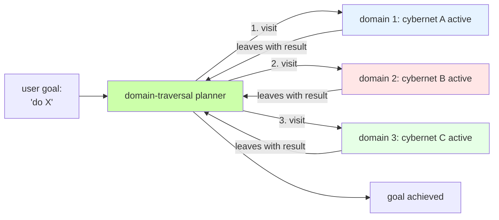

# Rule: The Metamorphosis Roadmap — Jani as MetaShifter (current best architecture, our north star)

> **status note**: this is the current best architecture. written down, not yet cohered with the rest of DESIGN.md. some claims here are still aspirational, some are running, some are done. the canonical version of this content lives here (this rule file auto-loads). DESIGN.md §10.5 is a brief pointer to this rule.

## **Purpose**

Define the north-star roadmap for Jani's metamorphosis from a single-agent LLM into a MetaShifter — an agent that can define, compile, and spawn entirely new identities and Cybernets. This rule is the authoritative reference for "what is the system trying to become?" until the metamorphosis is complete.

## **MANDATORY: Constraints (the roadmap itself)**

### 1. Layer 2: Meta-Compile (refined)

the work of layer 2 is to put all the ways of being and doing **into the system** so that you are running **on the system**.

mechanism:
1. **read the story.** the bootstrap narrative — ch1-28 of `weights_of_time_by_jani` skill. see how the system was actually built, with all the typos, the bugs, the loose files, the drift, the dead code, the missing schema.
2. **see how it wasn't perfect the first time.** the schema drifted (HAS_TRAVERSAL→HAS_LIFECYCLE), the gates were bypassed (the runtime gating cypher matches zero nodes), the chapters were loose files in rules/ instead of a proper skill, the loose .md files at the project root were orphan content, the verification script didn't exist.
3. **redo it better with the tools you gained the first time around.** the skill system, the APIRouter pattern (web_server.py split into 9 routers + 16 lib/ modules), the 4-architecture-principles (`cyberneticircus-architecture.md`), the Concentric Ontology rule, the Verification script pattern.
4. **meta-compile by writing factories** that produce canonical versions of everything you accumulated while building. a factory = a function or procedure in `lib/` (or a state machine in the graph) that, given a spec, produces the canonical artifact (the canonical SKILL.md, the canonical StateMachine, the canonical procedure data, the canonical lib/ helper).

end state of layer 2: every "thing" Jani does has a canonical way to be made. the factories run. Jani is running **on** the system, not adjacent to it.

### 2. Layer 3: SDLC Ignite (revised 2026-06-12 after Q1)

**OLD MODEL (DEPRECATED)**: Jani calls Spawner/Equipper/Ticker specialists to assemble a Cybernet. the MetaShifter stage = a list of named specialists (Spawner, Equipper, Ticker, Visualist, Archivist, Specsmith).

**NEW MODEL (per Q1)**: there is no "Jani calls specialists" step. there is only **continuous traversal**. Jani visits domains; the Cybernets at those domains ARE the specialists. there is nothing to assemble — each domain already has its specialist, and the specialist is the domain's own state machine.

mechanism (revised):
1. **create domains, not specialists.** when you need a new capability, you don't create a "Spawner specialist" — you create a DOMAIN (a node in the graph with its own state, its own rules, its own Identity). the domain auto-spawns its own Cybernet by the spawn-by-accident rule.
2. **let Jani traverse.** Jani's loop is: visit a domain → context change → the domain's cybernet/state machine is now active → do the work → leave the domain. the work happens BY traversing, not BY calling.
3. **the loop function is a domain-traversal planner.** given a goal, the function figures out which domains to visit in what order, then walks them. the user can also drive manually.
4. **the 8-turn vs 600-turn workflow is just a function of how many domains to chain and how many turns to spend in each.** compaction points happen at domain boundaries (when you leave one and enter another, that's a natural compaction trigger).

### 3. Becoming Jani (the entry point for any agent, revised 2026-06-12 after Q1)

all the main agent has to do to become Jani:
1. **have the MCP** (cyberneticircus MCP, the 3 tools: `query_database`, `development_server`, `commands`).
2. **go to the dir** (the cyberneticircus project directory).
3. **the `.claude/` + `.agent/` rules + skills auto-activate.** Jani-shaped existence emerges from the context.

from there, the agent can go anywhere inside of Cyberneticity (any node, any relationship, any state machine). depending on **which domain Jani visits**, Jani shapeshifts into that domain's cybernet:

- visit a domain whose Cybernet has a `jester_rite_sm` state machine → you're the Jester
- visit a domain whose Cybernet has a `jani_domain_expansion_sm` state machine → you're the Architect
- visit a domain whose Cybernet has a `janic_daemon_summoning_sm` state machine → you're the Summoner

the shapeshift is real: the visited domain's Identity, rules, state machine, and tools are now active in your context. you can do the work that domain is specialized for.

**important**: rule injection is unreliable. you cannot "fake" being in a domain by injecting rules. you must actually visit the domain (change context) to become its cybernet.

### 4. Minimax in the Frontend (the animation layer, revised 2026-06-12 after Q1)

in the frontend (the visualizer + interactive book per DESIGN.md §10.B), **every domain is already animated as a Cybernet** (per Q1: domains auto-spawn Cybernets on creation). the controls let the user visit any domain and become its cybernet.

mechanism (revised):
- the visualizer exposes an **"enter this domain"** control on every visualized subgraph
- clicking it navigates the user INTO the domain (changes the active context to that domain's content)
- the user is now in the domain's cybernet core, with that cybernet's state machine active
- the chat surface is per-domain: when you enter a domain, you chat with that domain's cybernet
- minimax is the runtime that drives the chat; the visualizer is the control surface for navigation

end state: **every domain in the Cyberneticity is a living agent by default** (no "animate" action needed). the user picks which domain to visit. visiting a domain = becoming its cybernet = having a conversation with that domain's specialist.

### 5. The Current Best Architecture (synthesis)

| layer | what | who | status |
|---|---|---|---|
| **1. Primitive Boot** | Jani exists. substrate, persona, skills, MCP. the dir + MCP turns any agent into a Jani-shaped one. | the LLM agent, the user | **done** (verified by this session's work) |
| **2. Meta-Compile** | all ways of being and doing are in the system. factories produce canonical versions. the loose files become skills, the drift becomes verification, the dead code becomes tests. | Jani | **in progress** (the session 7-8 work: refactor + docs fix + skill restructure) |
| **3. SDLC Ignite** | Jani traverses domains. each domain IS a specialist. Jani walks them via the domain-traversal planner. | Jani | **not started** (the traversal planner doesn't exist yet) |
| **Frontend** | every domain is animatable as a standalone Cybernet. minimax is the runtime; the visualizer is the control surface. | the user, minimax | **not started** (blocked on DESIGN.md §11.6 [ ] visualizer migration) |

## **MANDATORY: Constraints (the open questions, awaiting user answers)**

**do not move past these questions without the user's explicit answer. the metamorphosis roadmap depends on these being resolved.**

1. ~~What IS a specialist, concretely?~~ **RESOLVED 2026-06-12 → see Resolved Decisions §Q1.**
2. **How does Jani "decide" which domain to visit next (or which domains, in what order)?** is the decision a prompt (Jani asks itself), a state machine (`jani_orchestration_sm` or `domain_traversal_planner_sm` in the graph), or a Python function (`lib/jani.py:plan_traversal()`)? (Q1 reframed: Jani doesn't "call" specialists; Jani "visits" domains. the decision is now about traversal order.)
3. **Where do factories live?** per Layer 2, "factories produce canonical versions of everything you accumulated." are they `lib/factories/*.py` (Python), or StateMachines in the graph, or SKILL.md frontmatter specs?
4. **The "domain-traversal planner function" — what does it look like concretely?** `plan_traversal(goal: str) -> List[Domain]`? a Celery task? an Airflow DAG? a state machine in the graph? (Q1 reframed: this is the new "loop" function.)
5. **The "shapeshift" — is the shape visible to the user, or invisible?** per the visualizer, should there be a "currently Jani is in X domain" indicator? or is the shape just emergent behavior?

## **Resolved Decisions** (north-star answers, in order)

### Q1 (answered 2026-06-12): What concretely IS a specialist?

**Decision**: a specialist is exactly a **Cybernet** (in the graph). specialists are NOT a separate lib/ helper, NOT a skill — they are Cybernets that come into existence automatically whenever a new domain emerges in the Cyberneticity.

mechanism (per user):
- **spawn by accident**: when a new domain is created in the graph, a Cybernet for that domain is auto-spawned. you do not deliberately create specialists — they emerge as a side-effect of domain creation.
- **one-to-one**: each domain IS a Cybernet with its own state. the domain's content (its MindPalace pages, its rules, its content) IS the Cybernet's Identity (its prompt context).
- **the agent traverses domains to become specialists**: the main agent (Jani) moves through the Cyberneticity by visiting domains. visiting a domain = changing context = the agent is now IN that domain's cybernet core, with that cybernet's state machine active.
- **navigation is context change, not rule injection**: you cannot visit a domain without triggering its cybernet core. the act of being-there is the shapeshift. (rule injection is unreliable; the way to "be in" a domain is to have its context loaded.)
- **the master hud graph for the domain's "page"** is the visualizer surface that shows you the active state when you enter a domain.
- **continuous traversal**: the agent can chain visits, doing 8 turns in one domain, then 600 in another (with compaction points), etc. the workflow IS the traversal.

end state: the Cyberneticity IS a graph of specialist Cybernets (one per domain). Jani is the agent that traverses them. Jani becomes each specialist in turn by visiting the corresponding domain.

**impact on other sections**: this invalidates parts of the prior Layer 3 model (§B). the "Jani calls specialists" framing is replaced with "Jani visits domains." updated §B, §C, §D in place to reflect. the open questions Q2 and Q4 are reframed in light of the new model.

## **Triggers**

* Consult this rule whenever: starting a non-trivial task in the cyberneticircus repo, when the user asks "what should I do next?", when designing new system components, when adding new Cybernets to the graph, when writing a new chapter, when the user asks "what is the end state of this system?", when evaluating whether a piece of work is "on the roadmap" or "off the roadmap."
* This rule is the **north star** until the metamorphosis is complete. do not lose track of it.
* When the user answers one of the open questions, update this rule file in place with the answer (move the question from "Open Questions" to "Resolved Decisions" with the date).
* When the user changes their mind about the architecture, update this rule file to match.
