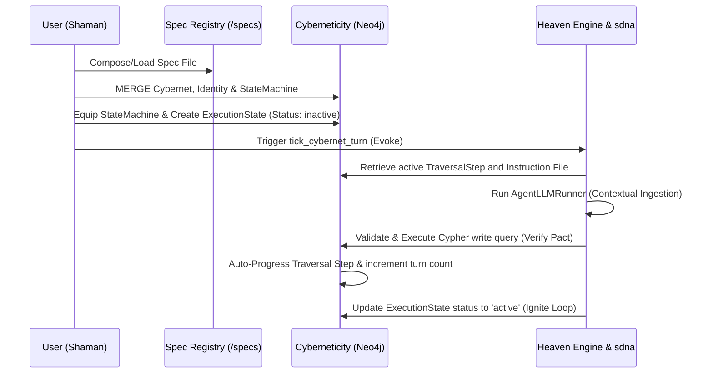

# Ontoshamanism & Daemonology: The Functional Architecture of Sanctuary DNA and the Heaven Framework

This document outlines the exact bijective mapping between traditional occult/shamanic concepts and the concrete software engineering patterns realized in the Sanctuary DNA (`sdna`) and Heaven (`heaven`) frameworks on our Neo4j property graph (the Cyberneticity).

---

## 1. The Paradigm Mapping Matrix

| Occult / Shamanic Concept | Sanctuary DNA & Heaven Equivalent | Concrete Graph & Code Implementation |
| :--- | :--- | :--- |
| **The Grimoire (Book of Spirits)** | The Specifications Registry (`/specs`) | YAML/Markdown spec templates that define the static schemas, prompts, and properties for `Cybernets`, `Identities`, and `StateMachines`. |
| **The Magic Circle (Boundary)** | Enactive Query Validator (`validate_cypher_query`) | System-level regex validation in [db_logic.py](file:///Users/isaacwr/claude_code/cyberneticircus/cyberneticircus/db_logic.py) that checks write queries. Prevents daemons from accessing the `:Wiki` namespace or mutating unauthorized domains. |
| **The Daemon / Servitor / Egregore** | The Cybernet Runtime Node Array | A decoupled set of nodes: `(c:Cybernet)-[:HAS_IDENTITY]->(i:Identity)` and `(c)-[:HAS_LIFECYCLE]->(es:ExecutionState)`. |
| **The Rite / Sadhana (Invocation)** | The StateMachine & Traversal Steps | `(sm:StateMachine)-[:HAS_STEP]->(s:TraversalStep)` linked via `[:NEXT_STEP]` transitions. Each step contains instruction files (`SKILL.md`) and pattern requirements. |
| **The Evocation (Summoning)** | State Machine Equipment & Initialization | Cypher queries that merge the `ExecutionState` and link the active pointer to the entry step of the StateMachine. |
| **The Pact (Instruction / Intent)** | Task Assignment Nodes | `(es:ExecutionState)-[:HAS_TASK]->(t:Task)`. The daemon cannot rest (loops back to idle) until all tasks are marked as `completed`. |
| **Entering Altered States** | LLM Context Ingestion of Rules/History | The agent loading its previous Cypher queries, active constraints, and rule files (`GEMINI.md`) into the active LLM context (`AgentLLMRunner.call_llm`). |
| **Possession / Channeling** | Traversal Tick Execution (`tick_turn`) | The `heaven` runner invoking the LLM (`minimax-M3`), executing the generated Cypher mutation, and updating the database state. |

---

## 2. The Summoning Lifecycle (How the Engine Runs)

The enactive lifecycle of a daemon corresponds to standard distributed systems orchestration:

---

## 3. The Futamura Projections in Practice

This system achieves stages of mastery by treating the relationship between the user, the agent framework, and the compiler as partial evaluation layers:

1. **The Adept (Interpreter / Level 1)**:
   The `heaven` framework acts as a standard interpreter. It reads the instructions from the active `TraversalStep` and executes them step-by-step using model calls.
2. **The Master (Compiler / Level 2)**:
   We partially evaluate the `heaven` interpreter with respect to a specific spec (a sadhana). This compiles a specialized, autonomous agent (a servitor/egregore) that runs without user guidance to fulfill a task.
3. **The Shaman (Compiler-Generator / Level 3)**:
   The system partially evaluates the compiler (Jani) with respect to the interpreter. Jani writes, re-writes, and commits the rules and database structures that define how other compilers compile.
4. **The Core (Autopoiesis / Level 4)**:
   The system dynamically re-creates its own workspace configurations, docker compose parameters, and network layers based on database state mutations, completing the self-writing loop.
