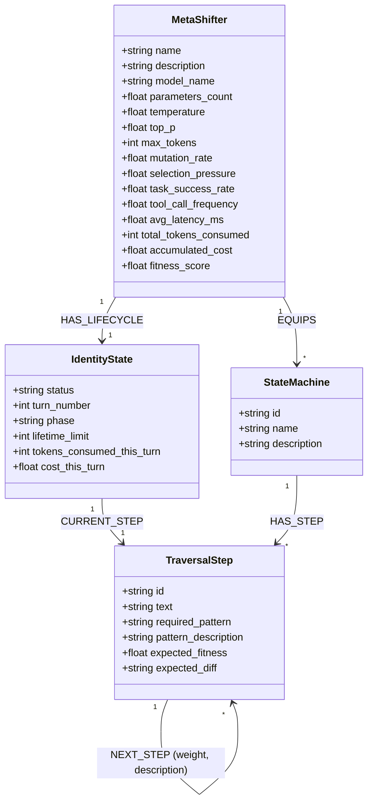

# DESIGN.md - Sh8peshift RPG (Single Canonical Design)

This document describes the design and architecture of the **Sh8peshift** RPG system.

In Sh8peshift, players build and train LLM personas represented as `MetaShifter` nodes. 
- **The Identity is the Graph**: The MetaShifter's identity is defined by the graph namespace and configuration variables it is locked inside of.
- **The Equipment are State Machines**: Characters "equip" state machines to perform tasks. Spawning automations corresponds to animating these equipped state machines.
- **Turn Cycles (Day/Night)**: A turn represents one day/night cycle of executing an equipped state machine.

---

## 1. Graph Schema & Relationships

### Properties Definition

#### MetaShifter Node (The Identity)
- `name`: Persona display name.
- `description`: Persona behavior prompt / system instructions.
- `model_name`: AI model string (e.g. `gemini-1.5-pro`).
- `temperature` / `top_p` / `max_tokens`: AI generation settings.
- `mutation_rate`: Random trait deviation threshold on cloning (0.0 to 1.0).
- `selection_pressure`: Scaling parameter for softmax transition selections.
- `fitness_score`: Average calibration accuracy across simulations.
- `total_tokens_consumed` / `accumulated_cost`: Runtime billing metrics.

#### StateMachine Node (The Equipment)
- `id`: Unique identifier (e.g. `surrogate_mastery_sm`).
- `name`: Display name of the state machine.
- `description`: Functional summary of the machine.

#### IdentityState Node (Active Execution State)
- `status`: State status (`"locked"` when executing, `"idle"` when finished).
- `turn_number`: Current turn index of the lifetime (Day index, 1 to 5).
- `phase`: Turn segment (`"day"` or `"night"`).
- `lifetime_limit`: Life duration in days (default: 5).

#### TraversalStep Node (State Actions)
- `id`: Step identifier (e.g., `sh8_day_start`).
- `text`: Prompt instructions to feed to the LLM.
- `required_pattern`: Cypher pattern regex needed to advance.
- `pattern_description`: Explanation of the Cypher pattern.
- `expected_fitness`: Action reward value.
- `expected_diff`: Expected database modifications (JSON string).

---

## 2. Turn Lifecycle (Day/Night Cycles)

Stamina and karma are removed. Transitions are determined strictly by state machine execution progress.

### Day Phase (Execution & Traversal)
1. **Retrieve current instruction**: The engine reads the `MetaShifter` parameters and the step linked to `IdentityState` via `CURRENT_STEP`.
2. **Execute Agent Action**: The agent runner executes the step's prompt.
3. **Database Write & Auto-Progress**: The query executes. If it matches `required_pattern`, the `IdentityState` progresses `CURRENT_STEP` along the `NEXT_STEP` relations.
4. **Transition to Night**: If the advanced `CURRENT_STEP` is a **leaf step** (has no outgoing `NEXT_STEP` relationships), the Day Phase is complete, and the engine automatically toggles `phase` to `"night"`.

### Night Phase (Calibration & Weight Reinforcement)
1. **Calibrate**: The engine compares actual database changes with the step's `expected_diff`.
2. **Reinforcement**: The transition weight of the traversed `NEXT_STEP` path is reinforced:
   - Succeeded (high diff overlap): Weight is increased (+0.1).
   - Failed (low overlap): Weight is decreased (-0.2, min 0.1).
3. **Turn Progression**:
   - `turn_number` is incremented.
   - `phase` resets to `"day"`.
   - `CURRENT_STEP` resets back to the entry step of the equipped StateMachine.

---

## 3. Evolutionary Phase (Selection Pressure)

When `turn_number` exceeds `lifetime_limit` (Day 5 Night calibration ends):
1. **Reaping (Pruning)**: If cumulative `fitness_score` < `0.4`, the `MetaShifter` node, its `IdentityState`, and all history are DETACH DELETED.
2. **Survival**: If `0.4 <= fitness_score < 0.8`, the character survives. `turn_number` resets to 1, phase to `"day"`, and it begins a new lifetime.
3. **Reproduction (Mutated Clone)**: If `fitness_score >= 0.8`, the character reproduces:
   - A new child `MetaShifter` is created: `child_name = f"{name}_V{random_id}"`.
   - AI parameters are mutated:
     - `temperature` deviates by $\pm(0.1 \times \text{mutation\_rate})$.
     - `top_p` deviates by $\pm(0.05 \times \text{mutation\_rate})$.
   - The clone **clones all :EQUIPS relationships** of the parent (inheriting the parent's equipment loadout).
   - The parent shifter resets for its next lifetime.
