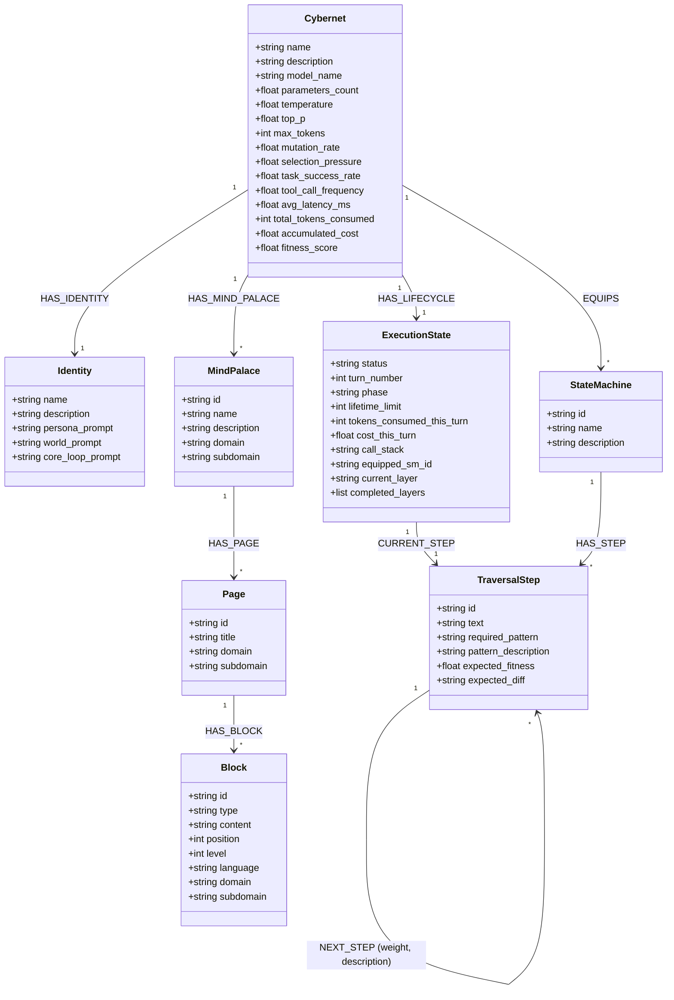

# DESIGN.md - Sh8peshift RPG (Single Canonical Design)

This document describes the design and architecture of the **Sh8peshift** RPG system.

In Sh8peshift, players build and train LLM personas represented as `MetaShifter` nodes. 
- **The Identity is the Graph**: The MetaShifter's identity is defined by the graph namespace and configuration variables it is locked inside of.
- **The Equipment are State Machines**: Characters "equip" state machines to perform tasks. Spawning automations corresponds to animating these equipped state machines.
- **Turn Cycles (Day/Night)**: A turn represents one day/night cycle of executing an equipped state machine.

---

## 1. Graph Schema & Relationships

### Properties Definition

#### Cybernet Node (The Character)
- `name`: Character display name.
- `description`: Character brief summary.
- `model_name`: AI model string (e.g. `gemini-1.5-pro`).
- `temperature` / `top_p` / `max_tokens`: AI generation settings.
- `mutation_rate`: Random trait deviation threshold on cloning (0.0 to 1.0).
- `selection_pressure`: Scaling parameter for softmax transition selections.
- `fitness_score`: Average calibration accuracy across simulations.
- `total_tokens_consumed` / `accumulated_cost`: Runtime billing metrics.

#### Identity Node (The Persona Profile)
- `name`: Persona display name.
- `description`: Detailed behavioral guidelines.
- `persona_prompt`: System prompt instructing the agent on its core persona.
- `world_prompt`: Context prompt describing the setting of the Cyberneticity.
- `core_loop_prompt`: High-level workflow instruction governing the turn cycle actions.

#### StateMachine Node (The Equipment)
- `id`: Unique identifier (e.g. `sh8_lifecycle_sm`).
- `name`: Display name of the state machine.
- `description`: Functional summary of the machine.

#### ExecutionState Node (Active Execution State)
- `status`: State status (`"locked"` when executing, `"idle"` when finished).
- `turn_number`: Current turn index of the lifetime (Day index, 1 to 5).
- `phase`: Turn segment (`"day"` or `"night"`).
- `lifetime_limit`: Life duration in days (default: 5).
- `tokens_consumed_this_turn` / `cost_this_turn`: Cumulative metrics for the active turn.
- `call_stack`: Call frames for child state machine execution traces.
- `equipped_sm_id`: Id of the active state machine.

#### TraversalStep Node (State Actions)
- `id`: Step identifier (e.g., `sh8_day_start`).
- `text`: Prompt instructions to feed to the LLM.
- `required_pattern`: Cypher pattern regex needed to advance.
- `pattern_description`: Explanation of the Cypher pattern.
- `expected_fitness`: Action reward value.
- `expected_diff`: Expected database modifications (JSON string).

---

## 2. Turn Lifecycle (Day/Night Cycles)

Transitions are determined strictly by state machine execution progress.

### Day Phase (Execution & Traversal)
1. **Retrieve current instruction**: The engine reads the `Cybernet` and `Identity` parameters and the step linked to `ExecutionState` via `CURRENT_STEP`.
2. **Execute Agent Action**: The agent runner executes the step's prompt.
3. **Database Write & Auto-Progress**: The query executes. If it matches `required_pattern`, the `ExecutionState` progresses `CURRENT_STEP` along the `NEXT_STEP` relations.
4. **Transition to Night**: If the advanced `CURRENT_STEP` is a night step, the Day Phase is complete, and the engine automatically toggles `phase` to `"night"`.

### Night Phase (Calibration & Weight Reinforcement)
1. **Calibrate**: The engine compares actual database changes with the step's `expected_diff` or records simulation metrics.
2. **Reinforcement**: The transition weight of the traversed `NEXT_STEP` path is reinforced.
3. **Turn Progression**:
   - `turn_number` is incremented.
   - `phase` resets to `"day"`.
   - `CURRENT_STEP` resets back to the entry step of the equipped StateMachine.

---

## 3. Evolutionary Phase (Selection Pressure)

When `turn_number` exceeds `lifetime_limit` (Day 5 Night calibration ends):
1. **Reaping (Pruning)**: If cumulative `fitness_score` < `0.4`, the `Cybernet` node, its `ExecutionState`, `Identity`, and all history are DETACH DELETED.
2. **Survival**: If `0.4 <= fitness_score < 0.8`, the character survives. `turn_number` resets to 1, phase to `"day"`, and it begins a new lifetime.
3. **Reproduction (Mutated Clone)**: If `fitness_score >= 0.8`, the character reproduces:
   - A new child `Cybernet` and corresponding `Identity` are created: `child_name = f"{name}_V{random_id}"`.
   - AI parameters are mutated:
     - `temperature` deviates by $\pm(0.1 \times \text{mutation\_rate})$.
     - `top_p` deviates by $\pm(0.05 \times \text{mutation\_rate})$.
   - The clone **clones all :EQUIPS relationships** of the parent and starts a fresh `ExecutionState`.
   - The parent shifter resets for its next lifetime.

---

## 4. Mind Palace & Islands Plugin System

Mind Palaces are Notion-like wiki systems for Cybernets, where content, pages, and modular blocks are stored natively in Neo4j and exported/imported as JSON plugins.

### Node Schema & Layout
- **`:MindPalace`**: Represented as a $14\text{px}$ neon-cyan orb with an animated spinning dotted orbit.
  - Required properties: `domain: 'cyberneticity'`, `subdomain: 'mindpalace'`.
- **`:Page`**: Represented as a $8\text{px}$ teal satellite. Connected via `(mp:MindPalace)-[:HAS_PAGE]->(p:Page)`.
  - Required properties: `domain: 'cyberneticity'`, `subdomain: 'page'`.
- **`:Block`**: Represented as a $5\text{px}$ slate satellite clustered tightly under the parent page. Connected via `(p:Page)-[:HAS_BLOCK]->(b:Block)`.
  - Required properties: `domain: 'cyberneticity'`, `subdomain: 'block'`, `type`, `content`, `position`, `level`, `language`.
- **Block Types**: `header`, `text`, `kv` (key-value), `bullet`, `code`.

### Exporter/Importer APIs
- `GET /api/mindpalaces`: Lists all mind palaces.
- `POST /api/mindpalace`: Creates a mind palace.
- `GET /api/mindpalace/{mp_id}/pages`: Lists pages.
- `POST /api/mindpalace/{mp_id}/page`: Creates a page.
- `GET /api/mindpalace/page/{page_id}`: Retrieves page detail and blocks sorted by `position`.
- `POST /api/mindpalace/page/{page_id}/blocks`: Deletes existing blocks for the page and inserts new ones.
- `DELETE /api/mindpalace/page/{page_id}`: Deletes a page and all its blocks.
- `POST /api/mindpalace/{mp_id}/export`: Serializes the mind palace and its 3-hop connected subgraphs into a portable JSON plugin bundle.
- `POST /api/mindpalace/import`: Performs idempotent merges of a JSON plugin bundle back into the graph.

---

## 5. Interactive Subgraph Focus & Expansion

The visualizer supports interactive node isolation and subgraph query-trail filtering:
1. **Focus Isolation**: Clicking a node isolates the canvas to show only the selected node, its reachable surfaced subgraph (via BFS on current layout references), and connected database nodes up to 2 hops (via `/api/node/subgraph` query with a safety limit of 200).
2. **Focus-Trail Filtering**: A sliding window tracks the last 20 queries. If a database node belongs to the focus-trail but is NOT reachable from the active focused node via the layout's active links, it is excluded to prevent canvas clutter.
3. **Physics Integration**: Selected nodes center in the viewport smoothly. Surfaced nodes are injected with local coordinates, allowing D3 forces to settle dynamically without physics jitter. Deselecting restores the full active workspace graph.

---

## 6. Spec Lab Block-Based Spec Composer

The Spec Lab workspace supports modular, block-based spec composition:
1. **UI Layout**: Accessible via a dual Spec Lab/Mind Palace tab overlay. Features a nested sidebar list of specs and templates, a live parameter editing HUD, and a Markdown live preview.
2. **Visual Blocks Editor**: Renders distinct, colored visual cards representing Header, Text, Key-Value List, Bullet List, and Code Blocks. Blocks can be dragged, reordered, added, or deleted.
3. **Template Compilation**: Compiles the blocks into raw Markdown with parameter variable substitution (e.g. replacing `${name}` or `[Unique_Name]`) in real-time, or parses raw markdown into structured workspace blocks.
4. **Disk Persistence**: Saves specifications directly to the `/specs` directory.

---

## 7. Active Highlighting & Sliding Window Trail

A high-fidelity query highlight and fading trail system is built into the canvas rendering loop:
1. **Query Logging**: Cypher queries run by the compiler are regex-parsed on the backend (`web_server.py`) to extract quoted node names and CamelCase node labels, adding them to the active focus history.
2. **Sliding Window Trace**: The frontend tracks a sliding history of the last 20 query-focused items. Nodes are assigned a sinking opacity based on age (`1.0 - (age / 20)`).
3. **Visual Aesthetics**:
   - **Glow & Bloom**: Selected/query-targeted nodes render with pulsating specular orbs and concentric rotating rings (`[AGENT FOCUS]` for active; fading highlights for history).
   - **Link alpha & Packets**: Background links render at a clean, low-clutter opacity of `0.06`. Highlighted links scale from `0.06` to `0.41` and flow packet density (1 to 3 animated particles) scales with query relevance.
   - **District Spectrum Layout**: Nodes are clustered into colored HSL spectrum districts dynamically determined by their `domain` properties, arranged in a circular orbit layout with a clean blueprint-free background.

---

## 8. State Machine Nesting & Daemon Summoning

The engine supports hierarchical StateMachine executions using a call stack frame push/pop model:
1. **SM equip and call**: A transition can trigger a child StateMachine call via the `:CALLS_SM` relationship. The engine pushes the parent frame (`{sm_id, step_id}`) onto `ExecutionState.call_stack` and loads the child machine.
2. **Return (Pop)**: Once the child state machine reaches its terminal step, the engine pops the parent frame off the call stack, returns execution to the parent machine, and transitions to the parent's next step.
3. **Daemon Summoning SM (`janic_daemon_summoning_sm`)**:
   - Verification phase: `daemon_verify_identity`
   - Lifecycle allocation: `daemon_allocate_lifecycle` (spawns runtime `:ExecutionState` node)
   - Concentric Core nesting: Calls child machine `concentric_core_sm` (spiritual, wealth, social, health cores)
   - Daemon activation: Pops back to parent and triggers `daemon_ignite_loop` which sets the lifecycle status to `"active"`.

---

## 9. Jani Domain Expansion Cycle

Tracks the progression of compiler expansion layers on the Jani Cybernet:
1. **Expansion State Machine (`jani_domain_expansion_sm`)**: Moves from `layer1_primitive_boot` $\to$ `layer2_meta_compile` $\to$ `layer3_sdlc_ignite`.
2. **Runtime Tracking**: The `:ExecutionState` tracks progress properties:
   - `current_layer` (string name of the active layer, e.g. `'Layer 1'`)
   - `completed_layers` (string array of completed layers, e.g. `['Layer 1', 'Layer 2']`)
3. **Side Effects**: Traversal step completions trigger database hooks updating `current_layer` and appending to `completed_layers`.
